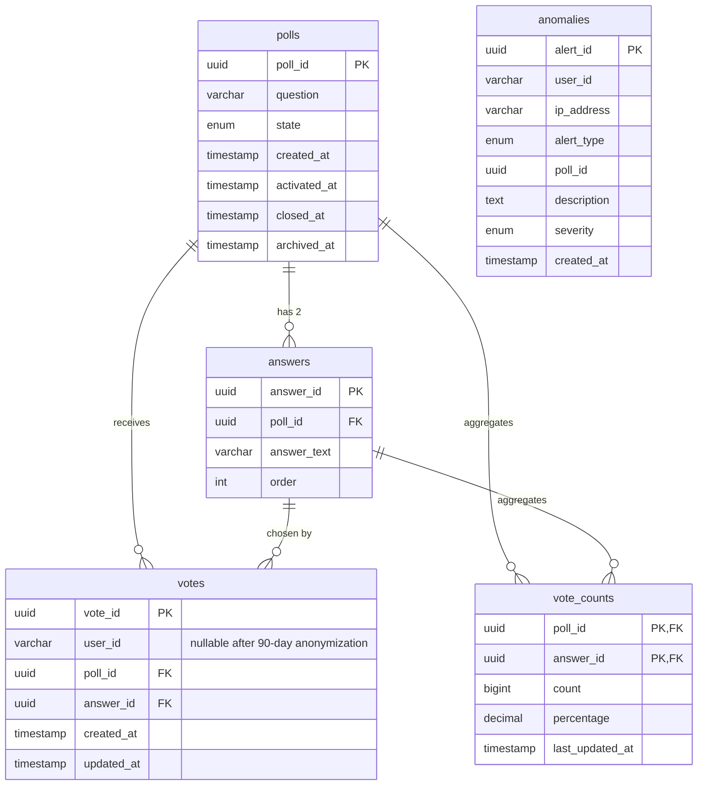

# Database Schema

Implements [I-001](../issues/I-001-database-schema.md). Source of truth for the
SQL is [scripts/schema/polls.sql](../../scripts/schema/polls.sql) and
[scripts/schema/indexes.sql](../../scripts/schema/indexes.sql) — this doc
explains the shape and the sharding model, not the exact DDL.

## Sharding model

`polls`, `answers`, `vote_counts`, and `anomalies` are **replicated**: the
same rows exist on every shard, so any shard can serve a read (e.g. "list
active polls") without a cross-shard join.

`votes` is **sharded by `user_id`**: a vote only lives on the shard its
voter hashes to (application-layer routing, out of scope for this issue —
see I-001's "Out of Scope"). This is what lets vote writes scale
horizontally across 8+ PostgreSQL instances.

## ER diagram

## Uniqueness

`votes` has `UNIQUE(user_id, poll_id)`, enforced per shard by PostgreSQL —
this is the ultimate source of truth for "did this user already vote on
this poll", with the Redis `SET NX` check (I-006) as a fast pre-write
guard that reduces (but doesn't replace) writes that would violate it.

## Anonymization

[scripts/migrations/002_anonymization_90days.sql](../../scripts/migrations/002_anonymization_90days.sql)
adds `anonymize_votes_older_than_90_days()`, a function that nulls
`votes.user_id` for votes older than 90 days. It's invoked on a recurring
schedule (daily cron / k8s CronJob), not automatically — the migration only
defines the function.

## Indexes

| Index | Table | Purpose |
|---|---|---|
| `idx_polls_state` | polls | List polls by state (active/closed/archived) |
| `idx_answers_poll_id` | answers | Fetch a poll's answer options |
| `UNIQUE(user_id, poll_id)` | votes | Uniqueness enforcement + user-vote lookups (self-indexing) |
| `idx_votes_poll_answer` | votes | Result aggregation per poll |
| `idx_votes_created` | votes | Anonymization sweep, time-range queries |
| `idx_anomalies_created` | anomalies | Recent-alerts dashboard |
